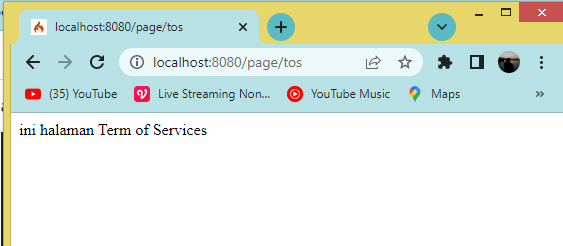
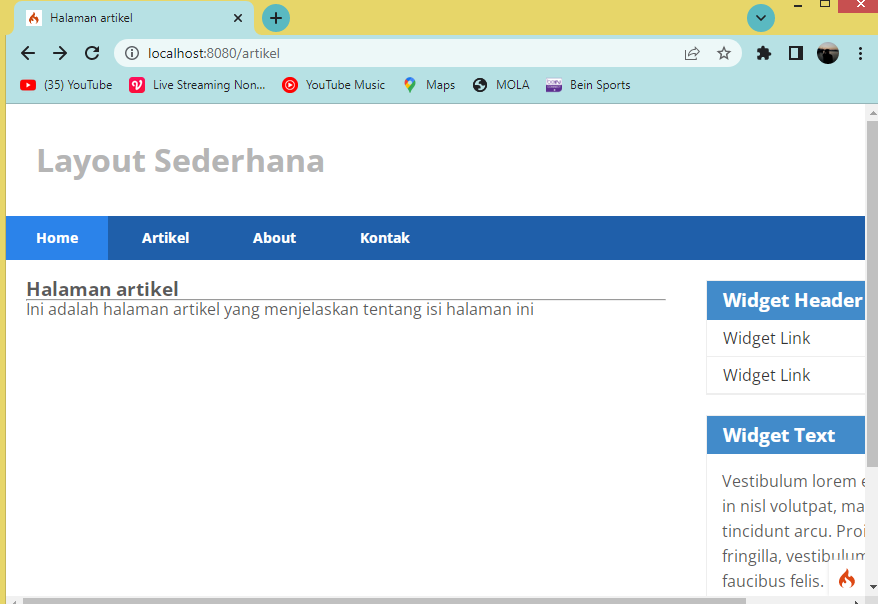

# Lab11Web
Latihan_11 1-6-2022

## Praktikum 11: PHP Framework (Codeigniter)

### Buat folder baru lab11_php_ci lalu Jalankan XAMPP Ubah file php.ini seperti berikut :

### Instal Codeigniter 4 simpan pada htdocs dan Buka http://localhost/lab11_php_ci/ci4/public/ , hasilnya :

### Buka cmd pada XAMPP Shell lalu buka php spark, untuk menjalankan server ketik "php spark serve" :

Hasil error/kesalahan

### Mengaktifkan mode Debugging dengan mengubah file .env menjadi = development, seperti berikut :

### Untuk mencoba Error hilangkan tanda ; (titik koma) pada Home.php, seperti berikut :

Contoh error/kesalahan akan ditampilkan secara detail

### Mengarahkan router pada controller, kemudian Membuat Route Baru Tambahkan kode berikut pada Route.php :

### Cek pada CMD dengan memasukan "php spark routes", Akses route yang telah dibuat dengan http://localhost:8080/about, hasilnya :

### Membuat Controller Page, dengan membuat file baru bernama page.php seperti berikut :

Hasilnya :

### Mengaktifkan AutoRouting dengan men set nilai true/false, jika true maka fungsi akan aktif

### Tambahkan method baru pada Controller Page seperti berikut untuk page Term of Services

Akses http://localhost:8080/page/tos hasilnya :

### Membuat View, dengan membuat file baru bernama about.php dan masukan kode berikut :

Ubah method about pada class Controller Page menjadi seperti berikut:

Selanjutnya refresh Kembali browser

### Membuat Layout Web dengan CSS
Buat file css pada direktori public dengan nama style.css

Kemudian buat folder template pada direktori view kemudian buat file header.php dan footer.php

`header.php`

`footer.php`

Kemudian ubah file app/view/about.php seperti berikut

Selanjutnya refresh tampilan pada alamat http://localhost:8080/about

## Pertanyaan dan Tugas
Lengkapi kode program untuk menu lainnya yang ada pada Controller Page, sehingga semua link pada navigasi header dapat menampilkan tampilan dengan layout yang sama.

Tambahkan kode berikut di dalam Routes.php

edit page control pada page.php

Buat file artikel.php dan contact.php pada direktori app/view/.....

saat kita membuka halaman artikel dan kontak maka tampilan akan menuju page artikel dan kontak

